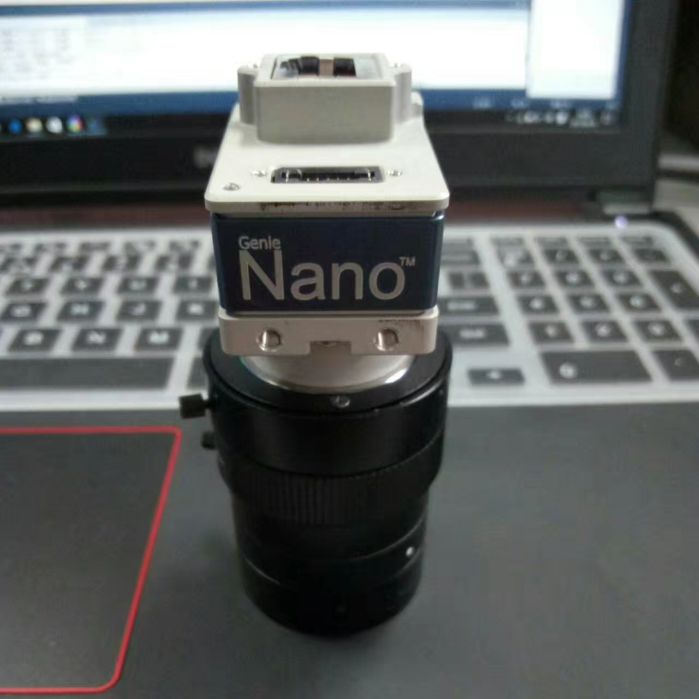

<div align="center">
    <h1>
    	Servo-Assembly
	</h1>
	
</div>


## About
```
此应用基于Windows系统开发，开发环境vs2010；
图像处理算法使用C++开发，基于opencv和halcon视觉库；
使用.Net框架用于界面显示与控制、串口通信与动态库调用。

```

## Catalogue

- Application
```
    * FindGear                      音筒外端拟合直线测试程序
    * prepare                       准备阶段的初始应用程序
    * vision                        伺服装配主程序
```
- Calibration
```
    * calibration_c_version         标定程序转C语言
    * calibration_demo              标定程序示例
    * mycalibration                 应用中确定使用的标定方案
```    
- Configure
```
    * opencv3.0.0                   opencv在vs2010中的配置方法
    * T_Nano-M4040_Default_Default  相机默认参数配置
```
- Documents
```
    * cammera                       关于相机的文档
    * communication                 关于通信的文档
```
- SerialPort
```
    * test                          C#串口通信示例
```

## Tools

Halocon 12.02 &  Genie SDK & OpenCV 3.0.0 and so on：
<https://pan.baidu.com/s/1M-NrJ4H04RbOWeMyE7MEEw>